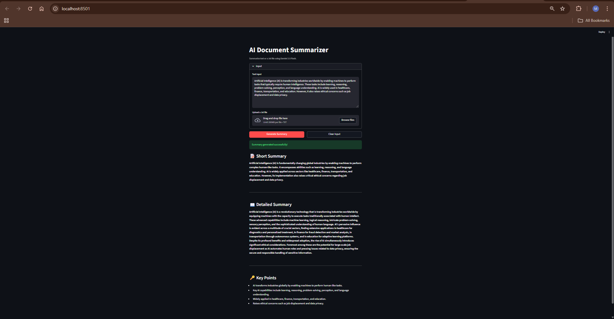

# 🤖 AI Document Summarizer

**Turn long documents into clear, structured summaries in seconds — powered by Gemini and wrapped in a clean Streamlit UI.**


---

## Overview

This project is a **beginner-friendly AI Document Summarizer** that accepts either **pasted text** or a **.txt file upload**, then generates a professional, structured summary with:

- **Short Summary** (3–4 concise lines)
- **Detailed Summary** (clear explanation)
- **Key Points** (clean bullet list)

The app uses the **Gemini API** (model: **Gemini 2.5 Flash**) and runs locally with Streamlit.

---

## Features

- 📝 Short summary generation
- 📖 Detailed summary generation
- 🔑 Key points extraction
- 📄 .txt file upload support
- 🎛️ Clean, responsive UI (Generate + Clear)

---

## Tech Stack

- **Python**
- **Streamlit** (UI)
- **Gemini API** via `google-genai`
- **python-dotenv** (loads `.env` locally)

---

## Screenshots



---

## Installation

### 1) Install dependencies

```bash
pip install -r requirements.txt
```

### 2) Run the app

```bash
streamlit run app.py
```

Streamlit will print a local URL in the terminal (commonly `http://localhost:8501`).

---

## Environment Variables

Create a `.env` file in the project root (this file should stay private):

```env
GEMINI_API_KEY=your_api_key_here
GEMINI_MODEL=gemini-2.5-flash
```

Notes:

- Do **not** wrap the key in quotes.
- Do **not** add spaces around `=`.

---

## Usage

1. Open the app in your browser.
2. Paste a long text into the input box **or** upload a `.txt` file.
3. Click **Generate Summary**.
4. Review the results under:
   - 📝 Short Summary
   - 📖 Detailed Summary
   - 🔑 Key Points

---

## Future Improvements

- Support PDFs and DOCX uploads
- Add “Export” options (Markdown / TXT)
- Add token/length controls for tighter summaries
- Improve reliability with stricter output schema (JSON + rendering)
- Add caching for repeated inputs

